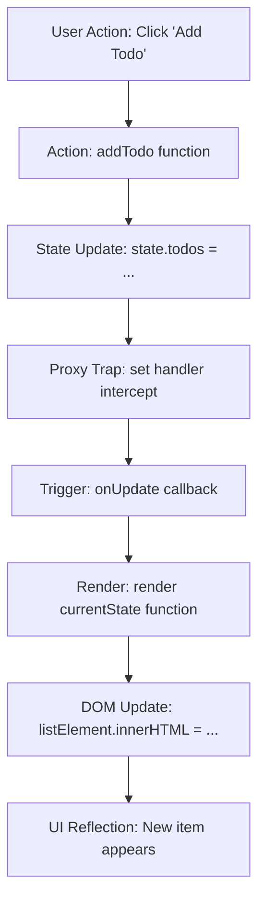

# How Vanilla JavaScript Handles State-Driven Rendering

This document explains how our application behaves like React by using **Vanilla JavaScript** to re-render the UI whenever the state changes.

---

## 1. index.html: The Static Skeleton
The `index.html` file serves as the foundation. Unlike traditional websites where HTML defines all the content, in reactive apps, the HTML provides "hooks" or "containers" for JavaScript to target.

### Key Elements:
*   `<div id="app">`: The main entry point where our dynamic content sits.
*   `<ul id="todoList"></ul>`: An empty shell that JavaScript will populate with data.
*   `<p id="stats"></p>`: Another placeholder for dynamic calculations.
*   `<script src="app.js"></script>`: Bridges the static page with our logic.

---

## 2. app.js: The Brain of the Application
The `app.js` file manages the **Data (State)** and the **Display (Render)**. It follows a consistent loop: **State Change → Trigger Re-render → Update DOM**.

### Step-by-Step Mechanism:

### Step A: The Reactive Proxy (`createReactiveState`)
In React, we use `useState`. In Vanilla JS, we can use a `Proxy`.
```javascript
function createReactiveState(initialValue, onUpdate) {
    return new Proxy(initialValue, {
        set(target, property, value) {
            target[property] = value; // Update the actual data
            onUpdate(target);         // IMMEDIATELY call the render function
            return true;
        }
    });
}
```
*   The **Proxy** intercepts any attempt to modify the `state` object.
*   Whenever we set a new value (e.g., `state.todos = [...]`), the `set` trap runs, updating the data and then triggering our `render` function automatically.

### Step B: The Render Function (`render`)
This function is responsible for taking the current data and transforming it into HTML.
```javascript
function render(currentState) {
    const listElement = document.getElementById('todoList');
    // ... logic to turn state.todos into HTML strings ...
    listElement.innerHTML = currentState.todos.map(todo => `...`).join('');
}
```
*   Every time the state changes, this function runs.
*   It clears out the old content and injects fresh HTML based on the new data.

### Step C: Triggering State Changes (Actions)
When a user clicks a button, we don't manually update the DOM. Instead, we **update the state**.
```javascript
function addTodo() {
    // 1. We update the state
    state.todos = [...state.todos, { ...newTodo }];
    // 2. The Proxy (Step A) notices this change and calls render (Step B)
}
```
This decoupling (separating behavior from display) is exactly what makes React powerful.

---

---

## 3. The Full Process Flow



1.  **DOMContentLoaded**: The browser loads `index.html` and executes `app.js`.
2.  **Initial Render**: `render(state)` is called once to show the starting data.
3.  **User Event**: User types a task and clicks "Add Todo".
4.  **State Update**: `addTodo()` updates the `state.todos` array.
5.  **Proxy Trap**: The `Proxy` catches the update and runs its `set` method.
6.  **Automatic Re-render**: The `set` method calls `render(state)`.
7.  **DOM Refresh**: The browser refreshes the `#todoList` with the new item.

---

### Summary
By using a **Proxy**, we've created a single source of truth (the State). We no longer have to manually find elements and update them one by one. We just change the data, and the UI "reacts" to it!
